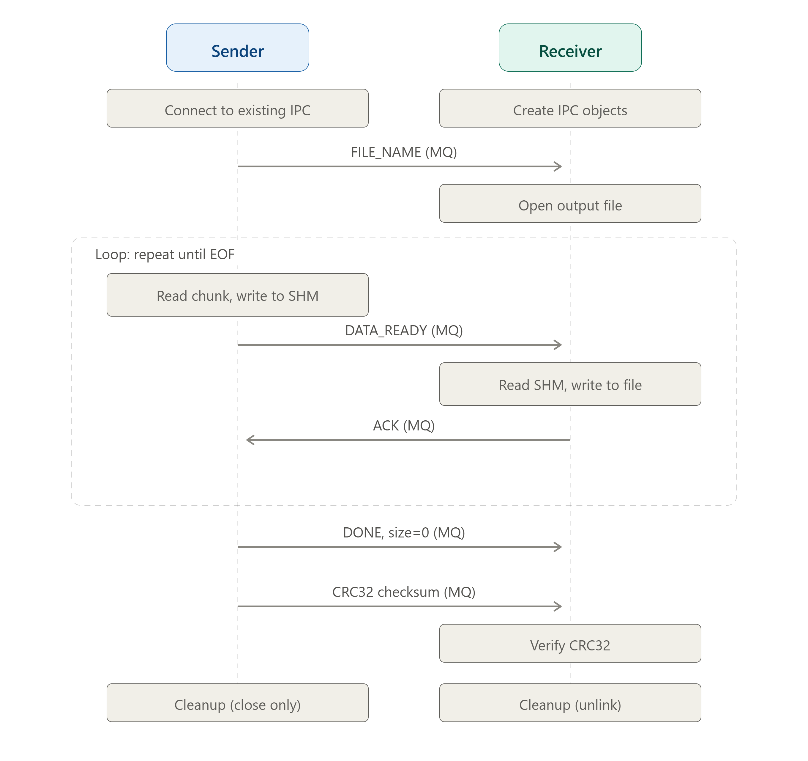

# POSIX IPC Sender & Receiver

[](LICENSE)


A production-grade C implementation of interprocess communication (IPC) using POSIX shared memory and message queues. Two processes collaborate to transfer files efficiently with data integrity verification, progress reporting, and robust error handling.

## Features

### Core IPC

- **POSIX Shared Memory** (`shm_open`, `mmap`) — High-speed data buffer for transferring file contents between processes.
- **POSIX Message Queues** (`mq_open`, `mq_send`, `mq_receive`) — Reliable synchronization and control signaling.

### Production-Grade Enhancements

- **Binary File Support** — Reads and writes in binary mode (`"rb"` / `"wb"`); handles any file type (images, archives, executables, etc.).
- **Data Integrity Verification** — CRC32 checksum computed on-the-fly during transfer; verified at the receiver for corruption detection.
- **Real-Time Progress & Metrics** — Percentage complete, transfer speed (KB/s), and elapsed time displayed during transfer.
- **Graceful Signal Handling** — Both programs handle `SIGINT` and `SIGTERM`, cleaning up all IPC resources before exit.
- **Configurable Chunk Size** — Choose shared memory buffer size from 512 bytes to 1 MB (`-c` option).
- **Custom Output Path** — Specify the destination file path (`-o` option on receiver).
- **Overwrite Protection** — Prevent accidental overwrites; use `-f` to force overwrite.
- **Structured Logging** — Timestamped log levels (ERROR, WARN, INFO, DEBUG) with optional file output.
- **Robust Error Handling** — Input validation, descriptive error messages, and proper cleanup on failure.
- **Comprehensive CLI** — Standard `--help`, `--version`, `-v` (verbose), `-q` (quiet) flags on both programs.

## Prerequisites

- **Operating System:** Linux or any POSIX-compliant system (macOS, BSD).
- **Compiler:** GCC (or any C99/C11 compatible compiler).
- **Libraries:** `librt` (POSIX shared memory and message queues). On Linux this is part of `glibc`.

## Quick Start

```bash
# 1. Build the programs
make

# 2. Start the receiver (in terminal 1)
./recv_c

# 3. Start the sender (in terminal 2)
./send_c example.txt

# 4. Find the received file
# The receiver creates "example.txt__recv" (or use -o to specify path)
```

## Project Structure

```
├── Makefile          — Build system (release, debug, install, uninstall, dist)
├── VERSION           — Version identifier
├── README.md         — This file
├── TODO.md           — Progress tracking
├── src/
│   ├── msg.h         — Shared header: message structures, constants, IPC object names
│   ├── sender.c      — Sender program: reads & transfers files
│   ├── receiver.c    — Receiver program: receives & writes files
│   ├── log.h         — Logging module: levels, timestamps, file output
│   ├── log.c         — Logging implementation
│   ├── crc32.h       — CRC32 checksum: data integrity verification
│   ├── crc32.c       — CRC32 implementation (IEEE 802.3 polynomial)
│   ├── ipc_utils.h   — Shared IPC utilities: init, cleanup, signal handling
│   └── ipc_utils.c   — IPC utility implementation
├── send_c            — Compiled sender binary
├── recv_c            — Compiled receiver binary
└── *.o               — Compiled object files
```

## Build

### Release (default)

```bash
make
```

### Debug (with sanitizers)

```bash
make debug
```

### Clean

```bash
make clean
```

### Install to System

```bash
sudo make install
```

Installs as `ipc-send` and `ipc-recv` to `/usr/local/bin`.

### Create Distribution Tarball

```bash
make dist
```

Creates `posix-ipc-<version>.tar.gz`.

## Usage

The receiver **must** be started **before** the sender, as the receiver creates the IPC objects.

### Receiver

```bash
./recv_c [options]
```

| Option                       | Description                                            |
| ---------------------------- | ------------------------------------------------------ |
| `-o, --output <path>`      | Custom output file path (default:`<name>__recv`)     |
| `-f, --force`              | Overwrite existing output file                         |
| `-c, --chunk-size <bytes>` | Shared memory chunk size (512–1048576, default: 4096) |
| `-t, --timeout <seconds>`  | Message queue timeout (1–300, default: 30)            |
| `-v, --verbose`            | Enable debug-level logging                             |
| `-q, --quiet`              | Suppress info/debug output                             |
| `--log-file <path>`        | Write logs to file (appended)                          |
| `--help`                   | Show help and exit                                     |
| `--version`                | Show version and exit                                  |

#### Examples

```bash
# Basic usage
./recv_c

# Custom output with verbose logging
./recv_c -v -o received_file.bin

# Overwrite existing file with larger chunk size
./recv_c -f -c 65536

# Quiet mode with log to file
./recv_c -q --log-file /tmp/recv.log
```

### Sender

```bash
./send_c [options] <filename>
```

| Option                       | Description                                            |
| ---------------------------- | ------------------------------------------------------ |
| `-c, --chunk-size <bytes>` | Shared memory chunk size (512–1048576, default: 4096) |
| `-t, --timeout <seconds>`  | Message queue timeout (1–300, default: 30)            |
| `-v, --verbose`            | Enable debug-level logging                             |
| `-q, --quiet`              | Suppress info/debug output                             |
| `--log-file <path>`        | Write logs to file (appended)                          |
| `--help`                   | Show help and exit                                     |
| `--version`                | Show version and exit                                  |

#### Examples

```bash
# Basic file transfer
./send_c document.txt

# Transfer a large binary file with verbose progress
./send_c -v -c 65536 bigfile.iso

# Quiet mode
./send_c -q image.png
```

## How It Works

### IPC Objects

| Object        | Name             | Purpose                                    |
| ------------- | ---------------- | ------------------------------------------ |
| Shared Memory | `/ipc_shm`     | Data buffer for transferring file contents |
| Send Queue    | `/ipc_mq_send` | Control messages: sender → receiver       |
| Ack Queue     | `/ipc_mq_ack`  | Acknowledgment: receiver → sender         |

### Communication Protocol



### Message Types

| Type                        | Value | Purpose                           |
| --------------------------- | ----- | --------------------------------- |
| `SENDER_DATA_TYPE`        | 1     | Data chunk ready in shared memory |
| `RECV_DONE_TYPE`          | 2     | Receiver finished reading chunk   |
| `FILE_NAME_TRANSFER_TYPE` | 3     | File name transfer                |

### Output File Naming

If no custom output path is specified (`-o`), the receiver appends `__recv` before the file extension:

| Input File         | Output File              |
| ------------------ | ------------------------ |
| `document.txt`   | `document__recv.txt`   |
| `image.png`      | `image__recv.png`      |
| `archive.tar.gz` | `archive__recv.tar.gz` |
| `noext`          | `noext__recv`          |

## Data Integrity

At the end of every transfer, the sender computes a CRC32 checksum over all data sent and transmits it to the receiver. The receiver independently computes the CRC32 over all received data and compares the two values:

- ✅ **MATCH** — Data integrity verified, file is intact.
- ❌ **MISMATCH** — Corruption detected. The output file should be discarded.

## Logging

Both programs feature a structured logging system with:

| Level     | Prefix                  | Default Output       |
| --------- | ----------------------- | -------------------- |
| `ERROR` | `[timestamp] [ERROR]` | Always displayed     |
| `WARN`  | `[timestamp] [WARN]`  | Visible unless`-q` |
| `INFO`  | `[timestamp] [INFO]`  | Visible unless`-q` |
| `DEBUG` | `[timestamp] [DEBUG]` | Only with`-v`      |

Use `--log-file <path>` to append logs to a file in addition to stderr.

## Performance Tuning

- **Larger chunk sizes** (e.g., 64 KB–1 MB) reduce IPC overhead for large files.
- **Smaller chunk sizes** (e.g., 512 bytes–4 KB) reduce memory footprint for constrained systems.
- Default chunk size (4 KB) balances performance and memory usage for general use.

## Error Handling

Both programs validate:

- Input file existence, type (regular file), and read permissions.
- Message queue operations with descriptive error messages.
- Shared memory mapping and I/O operations.
- Output file overwrite protection (receiver).

On any error, IPC resources are properly cleaned up before exit.

## Troubleshooting

| Symptom                                 | Likely Cause                        | Solution                                                                  |
| --------------------------------------- | ----------------------------------- | ------------------------------------------------------------------------- |
| `shm_open: No such file or directory` | Sender started before receiver      | Start`recv_c` first                                                     |
| `File exists` on output               | Output file already exists          | Use`-f` to overwrite or `-o` with new path                            |
| `shm_open: File exists`               | Stale IPC objects from previous run | Kill receiver with`Ctrl+C` to trigger cleanup, or manually `ipcrm -a` |
| Slow transfer                           | Small chunk size                    | Increase with`-c` option                                                |
| **CRC32 MISMATCH**                | Data corruption                     | Re-transfer the file                                                      |

## Cleanup

- Press `Ctrl+C` in either program to trigger graceful cleanup.
- The receiver unlinks all IPC objects (shared memory and message queues) on normal exit.
- The sender only closes its connections (receiver owns the IPC objects).


## Author

**Toan Tran**

## License

This project is provided under the [MIT License](LICENSE).
